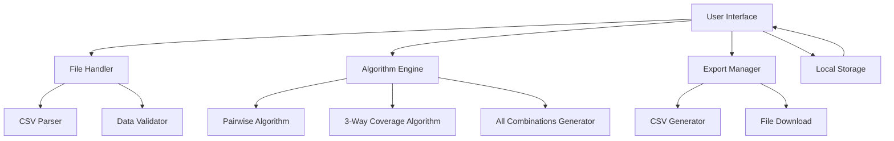

# Design Document

## Overview

テスト組み合わせ生成Webツールは、因子・水準データから効率的なテスト組み合わせを生成するSingle Page Application（SPA）です。フロントエンドのみで完結するクライアントサイドアプリケーションとして設計し、ペアワイズテストと3因子間網羅のアルゴリズムを実装します。

## Architecture

### System Architecture



### Technology Stack

- **Frontend Framework**: Vanilla JavaScript (ES6+) with HTML5/CSS3
- **UI Framework**: Bootstrap 5 for responsive design
- **File Processing**: FileReader API for CSV parsing
- **Download**: Blob API for file generation
- **Storage**: LocalStorage for session persistence

## Components and Interfaces

### 1. User Interface Components

#### MainApp Component
- 因子・水準入力フォーム
- ファイルアップロード領域
- アルゴリズム選択ボタン
- 結果表示テーブル
- ダウンロードボタン群

#### InputManager Component
```javascript
class InputManager {
  addFactor(name, levels)
  removeFactor(factorId)
  updateFactor(factorId, name, levels)
  validateInput()
  getFactorsData()
}
```

#### FileHandler Component
```javascript
class FileHandler {
  parseCSV(file)
  validateCSVFormat(data)
  convertToFactors(csvData)
}
```

### 2. Algorithm Engine

#### PairwiseGenerator
```javascript
class PairwiseGenerator {
  generate(factors)
  // IPOGアルゴリズムの実装
  // In-Parameter-Order-General algorithm
  buildInitialTestSet(factors)
  extendTestSet(newFactor, existingTests)
  coverRemainingPairs(factors, tests)
}
```

#### ThreeWayGenerator
```javascript
class ThreeWayGenerator {
  generate(factors)
  // 3因子間網羅アルゴリズム
  generateAllTriples(factors)
  buildCoveringArray(triples, factors)
}
```

#### AllCombinationsGenerator
```javascript
class AllCombinationsGenerator {
  generate(factors)
  calculateTotalCombinations(factors)
  generateCartesianProduct(factors)
}
```

### 3. Data Models

#### Factor Model
```javascript
class Factor {
  constructor(name, levels) {
    this.id = generateId()
    this.name = name
    this.levels = levels // Array of strings
  }
  
  validate()
  getLevelCount()
}
```

#### TestCase Model
```javascript
class TestCase {
  constructor(combinations) {
    this.id = generateId()
    this.combinations = combinations // Map<factorId, level>
  }
  
  toString()
  toCSVRow(factorOrder)
}
```

#### CoverageReport Model
```javascript
class CoverageReport {
  constructor(totalTests, coverage, reductionRate) {
    this.totalTests = totalTests
    this.coverage = coverage // percentage
    this.reductionRate = reductionRate // vs all combinations
  }
}
```

## Algorithm Implementation Details

### Pairwise Algorithm (IPOG)

IPOGアルゴリズムを使用してペアワイズテストケースを生成：

1. **初期テストセット構築**: 最初の2因子でベーステストセットを作成
2. **因子追加**: 残りの因子を1つずつ追加し、既存テストを拡張
3. **ペア網羅**: 未カバーのペアを最小限のテスト追加で網羅

### 3-Way Coverage Algorithm

3因子間網羅のための貪欲アルゴリズム：

1. **トリプル生成**: 全ての3因子組み合わせを列挙
2. **カバリングアレイ構築**: 最小限のテストケースで全トリプルを網羅
3. **最適化**: 重複削除と効率化

## Error Handling

### Input Validation
- 因子名の重複チェック
- 水準数の最小値チェック（各因子最低2水準）
- CSVフォーマット検証

### Algorithm Errors
- 因子数不足エラー（2因子間網羅: 最低2因子、3因子間網羅: 最低3因子）
- メモリ不足警告（組み合わせ数が大きすぎる場合）
- 計算タイムアウト処理

### File Processing Errors
- 不正なCSVフォーマット
- ファイルサイズ制限
- 文字エンコーディングエラー

## Testing Strategy

### Unit Testing
- 各アルゴリズムの正確性テスト
- CSVパーサーの境界値テスト
- データバリデーション機能のテスト

### Integration Testing
- ファイルアップロードからダウンロードまでの完全フロー
- 異なるブラウザでの互換性テスト
- レスポンシブデザインのテスト

### Performance Testing
- 大規模データセット（10因子以上）での性能測定
- メモリ使用量の監視
- アルゴリズム実行時間の測定

## User Experience Design

### Workflow
1. 因子・水準データの入力（手動またはCSVアップロード）
2. アルゴリズム選択（2因子間網羅/3因子間網羅/全網羅）
3. 生成実行とプログレス表示
4. 結果確認とカバレッジ情報表示
5. CSVダウンロード

### Responsive Design
- モバイルファーストアプローチ
- タブレット・デスクトップでの最適化
- アクセシビリティ対応（WCAG 2.1 AA準拠）

## Security Considerations

- クライアントサイドのみの処理（データはサーバーに送信されない）
- XSS対策（入力値のサニタイズ）
- CSVインジェクション対策
- ファイルサイズ制限による DoS 攻撃対策